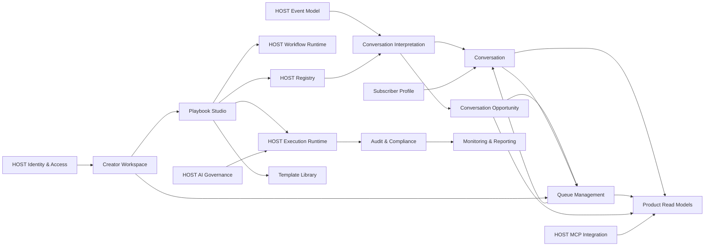

# Conversation Operations Platform
## Bounded-Context Map

### Core FunkMyFans contexts

- Creator Workspace
- Subscriber Profile
- Conversation
- Conversation Interpretation
- Conversation Opportunity
- Queue Management
- Playbook Studio
- Template Library
- Product Read Models

### Shared HOST Kernel primitives

- Event model
- Workflow runtime
- Execution runtime
- Durable execution
- Registry
- MCP integration
- Identity and access
- Generic AI governance primitives

### Supporting or future contexts

- Testing and Simulation
- Deployment and Release
- Audit and Compliance
- Monitoring and Reporting
- Integration / Channel Adapters
- Workflow / Task Management
- Commercialization / Entitlements

### Relationship map

### Truth ownership vs read models

| Context | Owns truth | Consumes read models from |
| --- | --- | --- |
| Conversation Interpretation | Deterministic interpretation of incoming platform events into business meaning | HOST Event Model, Registry |
| Conversation | Interaction state, participants, ownership, lifecycle | Conversation Interpretation, Queue Management, Subscriber Profile |
| Conversation Opportunity | Business opportunity identified inside a conversation | Conversation, Conversation Interpretation, Playbook Studio |
| Queue Management | Queue ownership, priority, transitions, queue items | Conversation, Conversation Opportunity, HOST Workflow Runtime |
| Playbook Studio | Playbook definition, script configuration, version intent, validation state | Registry, Template Library, HOST Workflow Runtime |
| Template Library | Reusable production-safe playbook templates | Playbook Studio, Registry |
| Product Read Models | UI-ready derived views for creators, moderators, queues, opportunities, and playbooks | Conversation, Queue Management, Conversation Opportunity, Playbook Studio, Audit & Compliance, Monitoring & Reporting |
| Creator Workspace | Creator scope and operational context | Identity and access, Queue Management, Conversation |
| Subscriber Profile | Subscriber identity, attributes, preferences, lifecycle | HOST Event Model, Conversation |
| Audit & Compliance | Immutable evidence of state change, approval, and override | Conversation, Queue Management, Playbook Studio, HOST Execution Runtime |
| Monitoring & Reporting | Aggregated telemetry, trends, alerts, and performance summaries | Queue Management, Conversation, Audit & Compliance, HOST Execution Runtime |

### Temporary adapters until HOST wiring is complete

- Event intake mapping adapter for host events into conversation interpretation
- Registry-backed taxonomy adapter for UI selectors
- Script configuration adapter for current save/test flows
- Read-model adapter for UI payloads that still depend on legacy shapes

### Critical boundary rules

- Conversation != Queue
- Script Design != Script Runtime
- Registry != Business Logic
- AI Governance != AI Execution
- Audit != Monitoring
- No FunkMyFans-local workflow engine, registry engine, or execution engine
- HOST owns generic workflow, execution, durable execution, registry, and MCP foundations
- FunkMyFans owns creator conversation business capability and product-domain read models

### Why Dashboard, Settings, and navigation are not bounded contexts

- Dashboard is a read-model composition surface. It summarizes multiple contexts and does not own domain truth.
- Settings is a configuration surface. It may touch several contexts but is not itself a domain boundary.
- App navigation is shell behavior. It routes users between contexts and surfaces, but it does not own business state.

### Architecture decision

1. Conversation != Queue
2. Script Design != Script Runtime
3. Registry != Business Logic
4. AI Governance != AI Execution
5. Audit != Monitoring

### Implementation guidance

- Prefer explicit contracts between FunkMyFans contexts and HOST primitives.
- Keep product write models separate from read models.
- Use vocabulary that creators and operators would naturally use: opportunity, playbook, template, script, version.
- Keep technical terminology internal where it is necessary for implementation, but not as the primary product language.
